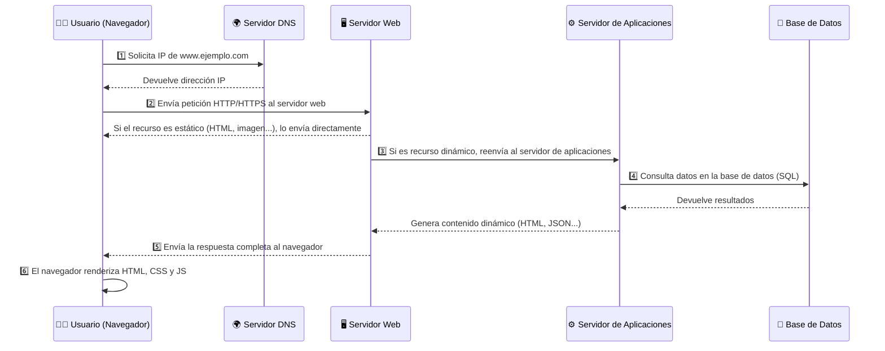


Entender la arquitectura de una aplicación web
Componentes que intervienen
Diferencia entre el front y el back


## ¿Qué es la Arquitectura Web?

El objetivo de la arquitectura web es **construir una aplicación que funcione en un entorno web**.  
Como toda construcción, implica **planificar, diseñar y construir** utilizando herramientas y materiales adecuados.

1. Planificar y analizar, diseñar y construir el producto final.
2. Usar materiales o herramientas adecuadas.
3. Trabajar con distintos roles profesionales: desarrolladores, diseñadores, administradores de sistemas.

---

### 🔹 Definición

> La **arquitectura web** _define la estructura y la forma en que se organizan los diferentes componentes de una aplicación que funciona en un entorno web_.  
> Como en la construcción de un edificio, necesitamos:
> - **Planos** → diseño
> - **Materiales** → tecnologías
> - **Profesionales** → desarrolladores, diseñadores, administradores de sistemas


Al principio del proyecto, hay que decidir qué **tecnologías** se van a utilizar.  
👉 Es como elegir los materiales y herramientas antes de construir un edificio.


---

## 🧩 Arquitectura: construyendo los planos


Planificando.



Herramientas.



Roles profesionales.


---

##  Componentes principales de una aplicación web

1. **Servidor web** → recibe las peticiones del cliente y devuelve una respuesta HTTP.  
   _Ejemplo: Apache, Nginx._

2. **Servidor de bases de datos** → gestiona la información.  
   _Ejemplo: MySQL, PostgreSQL, MongoDB._

3. **Módulo de ejecución en el servidor** → interpreta código dinámico.  
   _Ejemplo: PHP, Node.js, Python._

4. **Cliente web** → interpreta HTML, CSS y JavaScript.  
   _Ejemplo: navegadores._

5. **Lenguajes de programación** → construyen tanto la parte visible (frontend) como la lógica (backend).

---

## Diferencia entre Cliente (Frontend) y Servidor (Backend)

### 🖥️ Frontend (lado del cliente)

- Es la parte visible de la aplicación, con la que el usuario interactúa desde su navegador.
- Incluye **HTML** (estructura), **CSS** (estilo) y **JavaScript** (interactividad).
- Ejemplo: el formulario de registro o el botón de “Enviar”.

### ⚙️ Backend (lado del servidor)

- Es la parte que no se ve: se ejecuta en el servidor.
- Procesa las peticiones del cliente, accede a la base de datos y devuelve los resultados.
- Ejemplo: el código que guarda los datos del formulario en la base de datos.


El **frontend** muestra y recoge información del usuario,  
mientras que el **backend** la procesa, almacena y devuelve resultados.


---

| Aspecto | Frontend (cliente) | Backend (servidor) |
|:--|:--|:--|
| **Dónde se ejecuta** | En el navegador del usuario | En el servidor web |
| **Lenguajes habituales** | HTML, CSS, JavaScript, Vue, React | PHP, Python, Node.js, Java |
| **Función principal** | Mostrar la interfaz y captar datos del usuario | Procesar datos y comunicarse con la base de datos |
| **Ejemplo práctico** | Formulario de contacto en pantalla | Código que guarda el mensaje en una base de datos |
| **Resultado visible** | Sí, el usuario lo ve directamente | No, solo devuelve una respuesta |

---

##  Una metáfora: el restaurante web 

Imagina que una aplicación web funciona como un restaurante (🍽️):

- El **cliente (frontend)** es la **mesa del comensal**, con todo lo que el usuario ve e interactúa:  
  la carta, los cubiertos, el plato servido, el salero o las vinagreras.  
  Es el lugar donde el usuario decide qué quiere hacer y cómo ajustar su experiencia.

- El **servidor (backend)** es la **cocina del restaurante**.  
  Allí los cocineros preparan los platos según los pedidos recibidos, mezclan los ingredientes (los datos),  
  y devuelven el resultado terminado al cliente.

**El proceso completo:**

> El comensal (usuario) hace un pedido → el camarero (navegador) lo lleva a la cocina (servidor) →  
> los cocineros (backend) preparan el plato → lo devuelven a la mesa →  
> y el cliente puede añadir más sal o vinagre (interacciones frontend).

---

## 🍳 Siguiendo con la metáfora

- **Frontend** → la experiencia visible e interactiva (presentación).  
  _“El plato, la mesa, los utensilios, el salero y lo que el usuario toca.”_

- **Backend** → el trabajo oculto que genera el contenido (lógica y datos).  
  _“La cocina donde se preparan los platos según el pedido.”_

- **Base de datos** → la despensa donde se guardan los ingredientes.  
  _“Lugar donde se almacenan los productos (datos) para cocinar los platos.”_

- **HTTP / navegador** → el camarero que transporta la información.  
  _“Lleva los pedidos (peticiones) y devuelve las respuestas.”_

##  Conclusión

La arquitectura web permite que **cliente, servidor y base de datos trabajen juntos** para ofrecer una experiencia completa al usuario.

En los siguientes temas aprenderemos a construir paso a paso cada parte:
- cómo se estructura la información (**HTML, CSS, JS**),
- cómo se procesa en el servidor (**PHP, Node.js, Python (Django)**),
- y cómo se almacena (**bases de datos: Mysql, MongDB**).

Todo forma parte del mismo edificio: **una aplicación web.**

 Esquema del Proceso de Solicitud de una Página Web 

1. **Navegador del cliente**:
  - El usuario introduce una URL en el navegador web (ejemplo: `www.ejemplo.com`).

2. **Consulta DNS**:
  - El navegador envía una solicitud al **servidor DNS** para obtener la dirección IP correspondiente al nombre de dominio.

3. **Petición HTTP/HTTPS**:
  - El navegador realiza una solicitud **HTTP/HTTPS** a la dirección IP obtenida, pidiendo el recurso (una página web, archivo, etc.).

4. **Servidor Web**:
  - El **servidor web** (como Apache o Nginx) recibe la solicitud y verifica el recurso solicitado.

5. **Servidor de Aplicaciones** (si aplica):
  - Si la página requiere procesamiento dinámico (PHP, Java, Python, etc.), el **servidor de aplicaciones** genera el contenido necesario.

6. **Servidor de Bases de Datos** (si aplica):
  - Si es necesario, el servidor de aplicaciones consulta el **servidor de bases de datos** para obtener datos (ejemplo: contenido de un blog, productos de una tienda).

7. **Respuesta del Servidor**:
  - El servidor web envía el contenido solicitado de vuelta al navegador, ya sea una página estática o dinámica.

8. **Renderizado en el Navegador**:
  - El navegador interpreta el HTML, CSS y JavaScript recibidos, y muestra la página al usuario.


- **Caché**: Dependiendo de la configuración, el navegador o un servicio intermedio (CDN, caché del servidor) puede almacenar una copia temporal del recurso para acelerar solicitudes futuras.


### 🌐 Diagrama del proceso de carga de una página web


1️⃣ El usuario introduce una URL →  
2️⃣ Se resuelve la IP mediante DNS →  
3️⃣ El navegador envía una petición HTTP/HTTPS →  
4️⃣ El servidor web atiende o pasa la petición al servidor de aplicaciones →  
5️⃣ Si es necesario, se consulta la base de datos →  
6️⃣ El servidor genera y devuelve la respuesta →  
7️⃣ El navegador muestra la página renderizada.




*(Contenido avanzado, útil para cuando se estudie despliegue e infraestructura web.)*

- **Servidores Web:** gestionan contenido estático o dinámico.
- **Servidores de Aplicaciones:** ofrecen servicios a programas (seguridad, balanceo, sesiones…).
- **Servidores de Bases de Datos:** almacenan y sirven datos (MySQL, MongoDB…).
- **Proxies:** actúan como intermediarios (directos o inversos).
- **DNS:** traducen nombres de dominio en direcciones IP.



---

