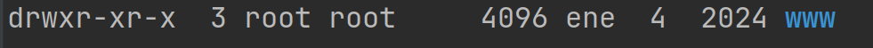
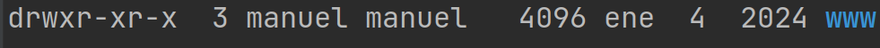

+++
title = 'practicando'
date = 2024-10-15T07:04:49+02:00
draft = false
icon = "fas fa-chalkboard-teacher"
weight = 10
+++
 
{}

#### Practicando 

Creamos en nuestro servidor web, dos sitios virtuales o virtual host, llamados www.informatica.com y www.musica.com
Cada uno de ellos van a tener esta peculiaridad de comportameiento y es que www.informatica.com va a ir a buscar los recursos a la carpeta /var/www/informatica, y www.muscia.com, a /var/www/musica

{}
### Creando los ficheros de configuración 

Para configurar dos sitios en Apache, vamos a crear dos archivos de configuración en `sites-available` y luego activarlos.

Lo primero vamos a la carpeta /etc/apache2/site-available, y nos copiamos el fichero de configuración que hay ahí  000-default.conf   a por ejemplo  informatica.conf  y  musica.conf .
Recuerda que son ficheros de confituración y debemos hacerlo como superusuario

sudo cp 000-default.conf informatica.conf 
sudo cp 000-default.conf musica.conf 

* Modificamos el dfichero con la nueva configuración
* Para ello lo editamos con un editor, por ejemplo **gedit**

sudo gedit informatica.conf

* y añadimos las siguientes líneas

  <VirtualHost *:80>
  ServerName www.informatica.com
  DocumentRoot /var/www/informatica
  </VirtualHost>

* El fichero original tiene muchas más líneas que podemos eliminar
* Todas las líneas que empiecen por **#**, son comentarios que no tienen efecto en la configuración.
* Hacemos lo mismo en musica.conf
* 
sudo gedit musuca.conf

* y añadimos su configuración
  
  <VirtualHost *:80>
  ServerName www.musica.com
  DocumentRoot /var/www/musica
  </VirtualHost>
  

### Modificación del archivo hosts

Para realizar pruebas en local, añade los siguientes dominios al archivo `hosts` en tu equipo. 

En Ubuntu, el archivo se encuentra en `/etc/hosts`; en Windows, en `c:\windows\system32\drivers\etc\hosts`. Añade estas líneas:


127.0.0.1 www.informatica.com 
127.0.0.1 www.musica.com 


Luego, puedes probar que los dominios responden ejecutando:


ping www.informatica.com
ping www.musica.com


### Activación de los sitios

Una vez que hayas creado estos archivos de configuración en `sites-available`, debes activarlos usando los siguientes comandos:


sudo a2ensite informatica.conf
sudo a2ensite musica.conf
sudo systemctl reload apache2


Esto creará los enlaces simbólicos en `sites-enabled` y recargará Apache para aplicar la configuración.

#### Creando el directorio
Ahora debemos de crear los directorios que hemos especificado para que apache vaya ahí, a buscar los recursos cuando se los soliciten.

Lo podemos hacer con nuestro edi, por ejemplo phpstorm.

Vamos a crear carpetas en  /var/www , por lo que tenemos que tener permisos de escritura y ser propietarios.

Ahí vemos que esta carpeta es de root, y nosotros no podremos crear recuros
Para ello ejecutamos el comando de cambiar de propietario (en nuestro ordenador somos  alumno . Yo en el ejemplo, como en mi equipo soy  manuel  pongo a ese usuario 
Podemos especificar la carpeta con ruta absoluta

sudo chown manuel:manuel /var/www

y me habrá cambiado el propietario

Ahora creamos las carpetas y recursos y ya los puedo acceder desde el navegador

